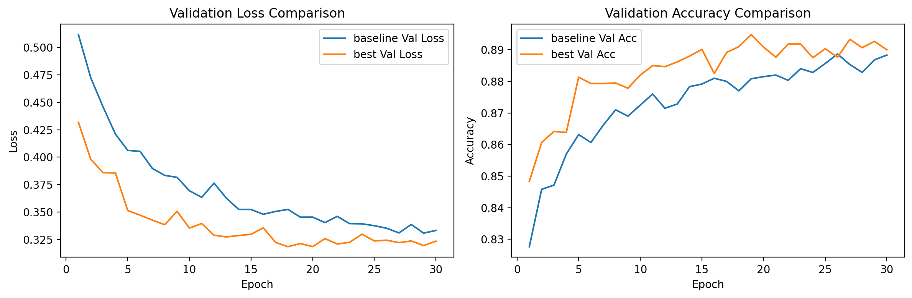
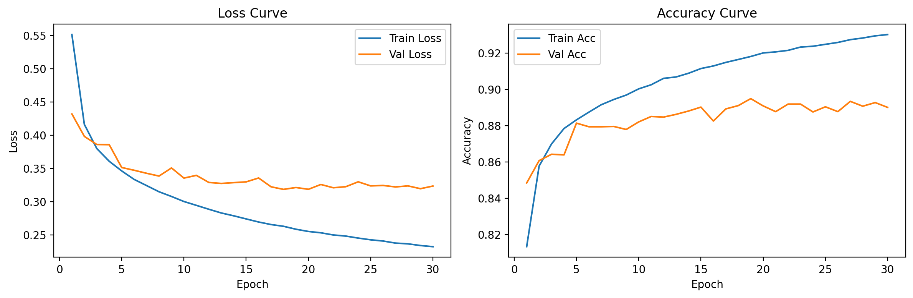
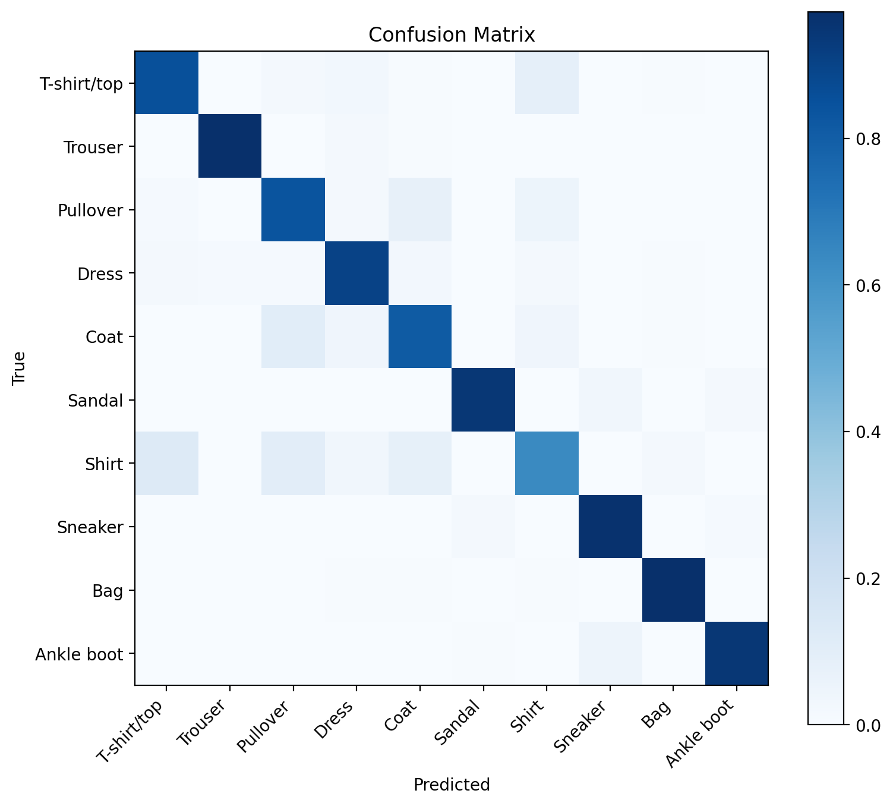
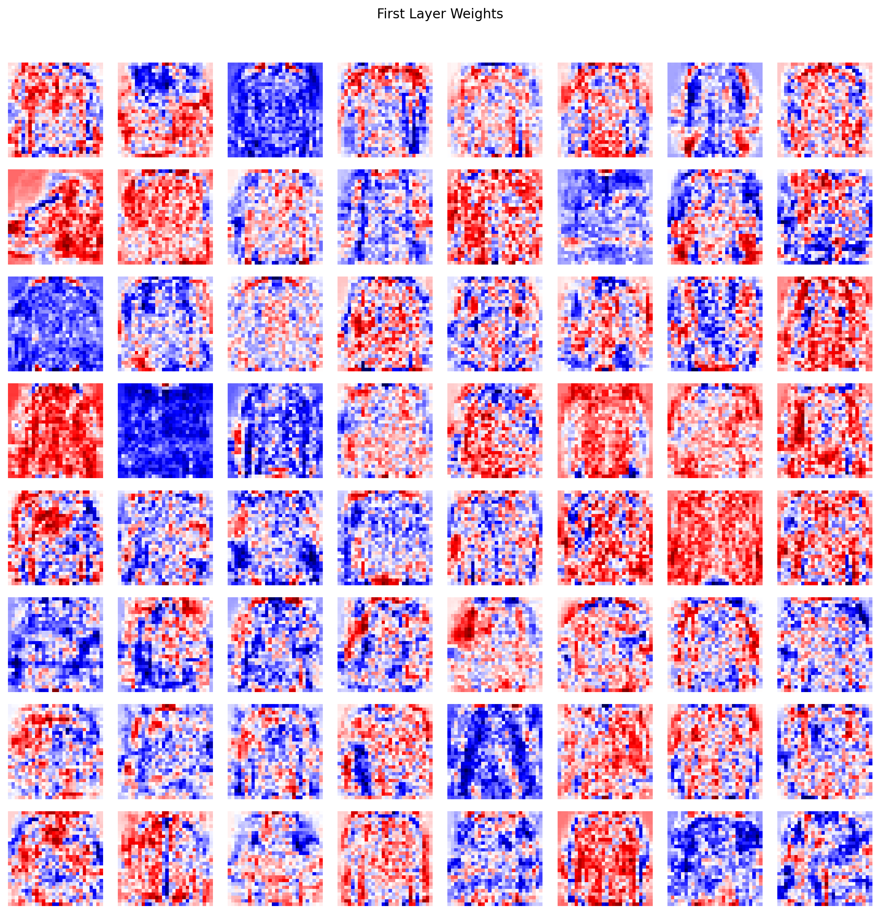
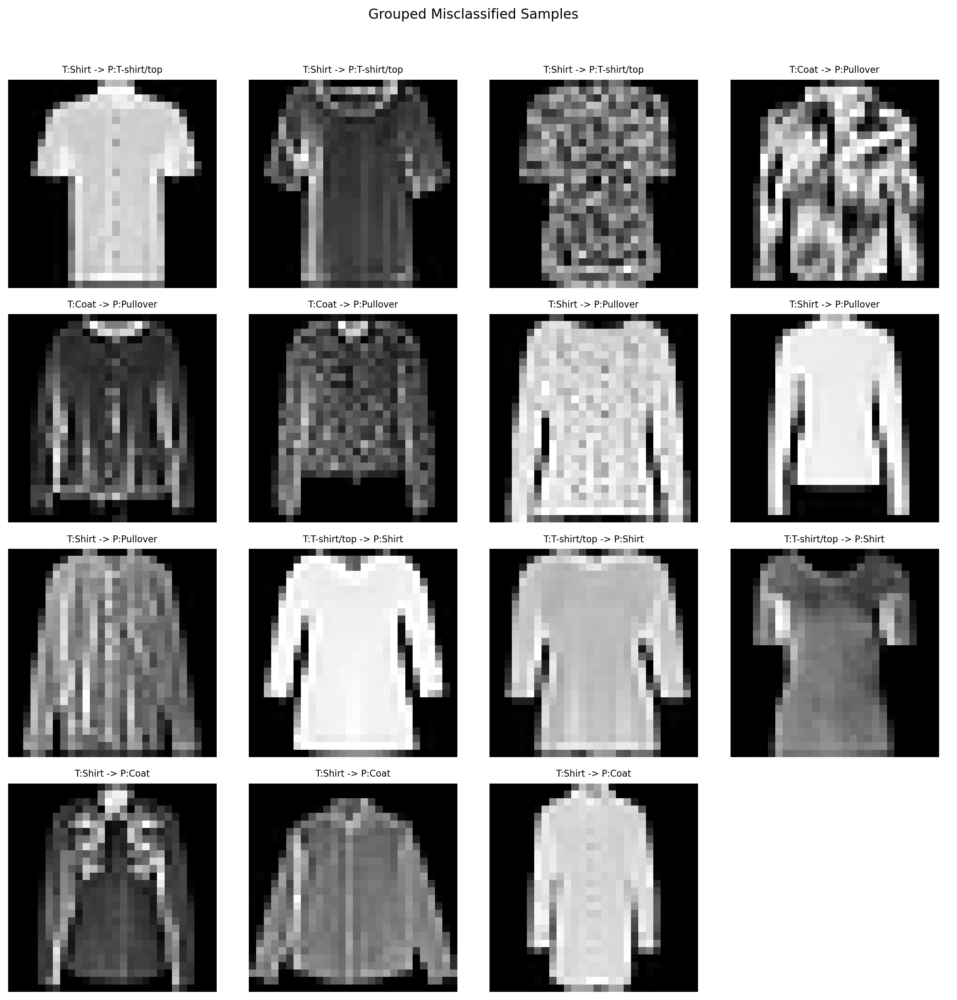

# Fashion-MNIST 图像分类实验报告

- 学号：xxxxxxxxxx
- 姓名：whysoty
- GitHub 链接：https://github.com/tyyyyy333/Fudan_SDS_CV_26Spring_HW
- 模型权重将同步上传于github

## 1. 任务概述

- 从零开始使用 NumPy 搭建并训练了一个多层感知机（MLP），在 Fashion-MNIST 数据集上完成 10 类服饰图像分类任务，
- 不使用 PyTorch、TensorFlow、JAX 等自动求导框架，利用numpy实现了线性层、激活函数、交叉熵损失、反向传播、优化器和学习率衰减机制，并在验证集上自动保存最优权重。

完成目标：

- 自主实现前向传播与反向传播；
- 支持不同隐藏层大小和不同激活函数切换；
- 实现 SGD / Adam、交叉熵损失、L2 正则化（weight decay）和学习率衰减；
- 基于验证集进行网格搜索并记录超参数对性能的影响；
- 在测试集上输出准确率、混淆矩阵，并结合可视化进行权重分析和错例分析。

最终结果：

- 在 `exp_grid` 中得到的最佳配置在测试集上达到 `88.41%` 的准确率，满足了模型实现、训练流程、参数搜索和结果分析的整体要求。

## 2. 项目结构与实现思路

- `data_process.py`：负责数据下载、预处理、训练/验证划分以及 `DataLoader`。
- `layer.py`：实现 `Linear`、`ReLU`、`Sigmoid`、`Tanh`、`Dropout`、`CrossEntropy` 等基础层及其反向传播。
- `model.py`：负责组织 MLP 结构，并提供参数保存、加载和推理接口。
- `optim.py`：实现 `SGD`、`Adam` 和学习率衰减策略。
- `train.py`：负责训练、验证、参数搜索、最优模型保存和实验汇总。
- `test.py`：负责加载最优权重，在测试集上评估并导出混淆矩阵和错例分析结果。
- `visualization.py`：负责绘制训练曲线、混淆矩阵、第一层权重和错分样本图像。

## 3. 数据集与预处理设计

本实验使用的数据集是 Fashion-MNIST。该数据集包含 10 个类别的灰度服饰图像，每张图片大小为 `28 x 28`。官方提供了 `60000` 张训练图像和 `10000` 张测试图像。

### 数据集划分

训练阶段将训练集进一步划分为：

- 训练集：`54000`
- 验证集：`6000`
- 测试集：`10000`

### 数据预处理

- 统一先将像素值归一化到 `[0,1]`，再将二维图像展平成长度为 `784` 的一维向量，以适配 MLP 输入
- 除此之外，额外设计了四种预处理模式用于做对比实验：

| 预处理模式    | 具体操作           | 设计目的                     |
| :------------ | :----------------- | :--------------------------- |
| `baseline`  | 仅归一化 + 展平    | 作为标准基线                 |
| `flip`      | 随机水平翻转       | 检查简单增强是否能提升泛化   |
| `mask`      | 随机像素遮挡       | 检查轻量扰动是否能提升鲁棒性 |
| `flip_mask` | 同时使用翻转和遮挡 | 观察叠加增强是否有效         |

- 适度的数据增强可能会改善泛化能力，但对于 Fashion-MNIST 这种分辨率只有 `28x28` 的灰度图，过强的扰动也可能直接破坏关键形状信息。从最终结果来看，这种判断基本是成立的。

## 4. 模型结构与训练方法

### 网络结构

项目实现了标准的三层全连接 MLP。模型输入维度固定为 `784`，输出维度固定为 `10`，隐藏层结构允许自由切换。在实验中，重点考察了以下三种隐藏层规模：

- `[128]`
- `[256]`
- `[512]`

这里的 `[128]` 表示单隐藏层 128 维；`[256]` 和 `[512]` 同理。实验过程中，对不同激活函数进行了比较，包括：

- `ReLU`
- `Tanh`
- `Sigmoid`

其中 `ReLU` 通常具有更快的收敛速度，`Tanh` 在浅层网络中有时会表现出更平滑的表征能力，而 `Sigmoid` 在深层或较大权重下更容易出现梯度饱和问题

### 损失函数与反向传播

使用交叉熵损失函数，并将其与 softmax 概率输出对应起来。反向传播的实现核心链路如下：

1. 线性层保存输入张量；
2. 前向传播时计算 `xW + b`；
3. 交叉熵损失先基于 logits 计算 softmax 概率，再求平均损失；
4. 反向传播时从损失对 logits 的梯度开始，逐层反传到隐藏层和输入层；
5. 对每个参数分别保存梯度，再交给优化器完成更新。

### 优化器、正则化与学习率衰减

项目实现了两个优化器：

- `SGD`
- `Adam`

同时，在优化器中加入了 `weight_decay`，用于实现 L2 正则化。学习率衰减采用指数衰减形式，每个 epoch 后根据给定的 `gamma` 对学习率做衰减。

## 5. 实验设置与搜索空间

项目支持对预处理、模型结构和优化策略进行组合搜索

具体结果见 `outputs/exp_grid/search_results.csv` ，一共保留了 `20` 组试验结果。搜索空间主要包括：

- 预处理：`baseline / flip / mask / flip_mask`
- 隐藏层规模：`[128] / [256] / [512]`
- 激活函数：`ReLU / Tanh / Sigmoid`
- Dropout：`0.0 / 0.2`
- 优化器：`SGD / Adam`
- 学习率：`0.01 / 0.001`
- 学习率衰减：`0.95 / 0.85`
- Weight Decay：`1e-4 / 5e-4`

其中，参数搜索采用“验证集选优，测试集只对最佳配置评估一次”的策略

 baseline 配置为：

| 项目         | baseline     |
| :----------- | :----------- |
| 预处理       | `baseline` |
| 隐藏层       | `[256]`    |
| 激活函数     | `ReLU`     |
| Dropout      | `0.0`      |
| 优化器       | `SGD`      |
| 学习率       | `0.01`     |
| 学习率衰减   | `0.95`     |
| Weight Decay | `1e-4`     |

最终搜索得到的最佳配置为：

| 项目         | best         |
| :----------- | :----------- |
| 预处理       | `baseline` |
| 隐藏层       | `[128]`    |
| 激活函数     | `Tanh`     |
| Dropout      | `0.0`      |
| 优化器       | `Adam`     |
| 学习率       | `0.001`    |
| 学习率衰减   | `0.95`     |
| Weight Decay | `1e-4`     |

- 注意，最佳模型并不是参数最多的模型，这说明在 Fashion-MNIST 这种相对简单的数据集上，训练策略和特征表达方式往往比“盲目增大网络规模”更重要。

## 6. 实验结果与分析

### 6.1 总体性能

最终采用最佳配置重新训练得到的主要结果如下：

- 最佳验证准确率：`0.8948`
- 最佳验证损失：`0.3212`
- 测试准确率：`0.8841`
- 测试损失：`0.3491`

作为对照，baseline 模型的结果为：

- baseline 验证准确率：`0.8887`
- baseline 测试准确率：`0.8806`
- 经过参数搜索后，最终模型相对于 baseline 在测试集上提升了大约 `0.35` 个百分点
- 考虑到 Fashion-MNIST 于一个纯 MLP 的上限本身有限，且最佳模型使用了更少的参数量，这个提升从绝对值上看不算巨大，但仍然具有意义，

### 6.2 Top-K 搜索结果

从搜索结果来看，排名靠前的几组实验如下：

| 排名 | 预处理    | 隐藏层    | 激活函数 | Dropout | 优化器 | 学习率 | 衰减 | Weight Decay | 最佳验证准确率 |
| ---: | :-------- | :-------- | :------- | ------: | :----- | -----: | ---: | -----------: | -------------: |
|    1 | baseline  | `[128]` | Tanh     |     0.0 | Adam   |  0.001 | 0.95 |         1e-4 |         0.8952 |
|    2 | flip      | `[256]` | Tanh     |     0.0 | Adam   |  0.001 | 0.95 |         5e-4 |         0.8838 |
|    3 | baseline  | `[256]` | Tanh     |     0.2 | Adam   |  0.001 | 0.95 |         5e-4 |         0.8802 |
|    4 | mask      | `[256]` | Tanh     |     0.2 | Adam   |  0.001 | 0.95 |         1e-4 |         0.8772 |
|    5 | flip_mask | `[256]` | ReLU     |     0.2 | Adam   |  0.001 | 0.95 |         1e-4 |         0.8770 |

从这张表里，我能看到几个比较稳定的趋势：

- 最优几组几乎都使用了 `Adam`；
- `Tanh` 在最高分配置里出现频率很高；
- 最优模型并不依赖复杂预处理，`baseline` 反而是最强；
- `[128]` 或 `[256]` 这种中小规模网络明显比 `[512]` 更适合当前任务。

### 6.3 训练曲线分析

下面是 baseline 和 best 模型在验证集上的损失与准确率对比图：



从图中可以看到：

- best 模型从训练初期开始，验证损失就整体低于 baseline；
- 在准确率曲线上，best 模型大多数 epoch 都位于 baseline 之上；
- best 模型在前 5 个 epoch 左右就建立了明显优势，后期虽然提升趋缓，但整体更稳定；

只看 best 模型本身的训练过程，可以看到训练损失和验证损失都在持续下降，验证准确率在第 `19` 个 epoch 达到峰值：



- 但训练存在过拟合的现象，中后期验证集准确率与训练集存在逐渐放大的差距

## 7. 超参数影响分析

### 7.1 预处理方式的影响

按预处理方式统计验证准确率均值后，得到：

| 预处理    | 平均验证准确率 | 最好验证准确率 | 观察                                     |
| :-------- | -------------: | -------------: | :--------------------------------------- |
| baseline  |         0.8749 |         0.8952 | 整体最稳，说明原始灰度轮廓信息已经足够   |
| mask      |         0.8627 |         0.8772 | 适度遮挡有时有帮助，但整体略伤害信息表达 |
| flip      |         0.8620 |         0.8838 | 有一定正则化效果，但不如 baseline 稳定   |
| flip_mask |         0.8398 |         0.8770 | 扰动过强，整体最差                       |

- Fashion-MNIST 和自然图像不一样，其判别信息很大程度上依赖轮廓、衣领、袖型、鞋帮高度等局部结构。对于分辨率只有 `28x28` 的灰度图来说，随机翻转和随机遮挡虽然能增加多样性，但也容易直接破坏本就有限的形状线索，因此 baseline 反而表现最好。

### 7.2 激活函数的影响

按激活函数统计均值后，观察到：

- `ReLU` 的平均验证准确率略高于 `Tanh`；
- 但从单组最好结果来看，`Tanh` 得到了全实验最高分；
- `Sigmoid` 的整体表现最差。

对此的理解是：

- `ReLU` 在平均意义上更稳健，梯度问题最小，均值更高；
- `Tanh` 在部分组合里能学到更平滑的表征，故峰值更高；
- `Sigmoid` 由于区间饱和问题，在这个任务和当前搜索范围内不占优势。

### 7.3 优化器与学习率的影响

按优化器统计：

- `Adam` 平均验证准确率：`0.8745`
- `SGD` 平均验证准确率：`0.8431`

考虑到Epoch和lr，说明在纯 NumPy 的 MLP 实现中，`Adam` 对于不同结构和预处理组合的适配性更强，也更容易在较少调参成本下得到稳定结果。

进一步看学习率与衰减参数的组合，表现最好的区间主要集中在：

- 学习率：`0.001`
- 学习率衰减：`0.95`
- Weight Decay：`1e-4` 或 `5e-4`

而 `0.01` 学习率更多是和 `SGD` 绑定出现，整体不如 `Adam + 0.001` 稳定。

### 7.4 网络规模的影响

按隐藏层规模统计均值后，得到：

- `[256]` 的平均表现最好；
- `[128]` 虽然平均略低，但拿到了全实验最高分；
- `[512]` 的平均表现明显最差。

这说明更大的模型并不一定更强，对于 Fashion-MNIST 这种数据量适中、输入分辨率低、类别特征相对粗粒度的任务，过大的网络在没有卷积归纳偏置的情况下更容易训练不稳定，或者出现不必要的复杂参数拟合；反而较小的 MLP 更容易被优化到一个效果不错的位置。

## 8. 混淆矩阵分析

下面是最佳模型在测试集上的归一化混淆矩阵：



从混淆矩阵中，能看出以下几点：

- `Trouser`、`Bag`、`Ankle boot`、`Sneaker` 的对角线最深，说明这几类最容易识别；
- `Shirt` 的对角线明显比其他类别浅，说明它是最难分类的类别之一；
- `Pullover`、`Coat`、`T-shirt/top` 和 `Shirt` 之间存在较明显的互相混淆；
- 鞋类内部也存在 `Sneaker -> Ankle boot` 的混淆，但程度低于上衣类混淆。

这和直观认知相一致：裤子、包、短靴这类类别具有更明显的整体形状特征，而上衣类之间更多依赖衣领、袖长、开襟、材质厚薄等细节信息，这些细节在 `28x28` 灰度图里往往很难完整保留。

## 9. 权重可视化与空间模式分析

最佳模型第一层权重图如下：



可以看到一些比较典型的模式：

- 有些神经元已经学到了比较完整的服饰轮廓，如上衣外形或鞋类大致边界；
- 有些神经元更关注局部区域的对比变化，如衣领、袖口、下摆等位置；
- 有些神经元更像是在提取“明暗分布模式”，对应局部纹理或垂直边缘结构；
- 这说明，MLP在无局部感受野的情况下，仍然能够通过全连接权重学出一部分与轮廓、边缘和局部区域相关的表征模式

## 10. 错例分析

下面是按照高频混淆类别分组整理出的错分样本：



以下是最主要的几类错误：

| 高频错误             | 次数 | 分析                                                 |
| :------------------- | ---: | :--------------------------------------------------- |
| Shirt -> T-shirt/top |  127 | 两者都是上身服饰，且在低分辨率下袖型和领口差异不明显 |
| Coat -> Pullover     |  103 | 外形接近，厚外套与套头衫在灰度图中边界差异不够稳定   |
| Shirt -> Pullover    |  101 | 都属于上衣类，纹理细节缺失时更依赖整体轮廓，容易混淆 |
| T-shirt/top -> Shirt |   84 | 与第一类错误对称，本质上是同一类视觉歧义             |
| Shirt -> Coat        |   80 | 衬衫在某些样本里下摆较长或轮廓较宽时会被误认为外套   |

理解：

- 模型在遇到类别边界本来就模糊、分辨率又不足的样本时，更容易依赖粗粒度轮廓做判断，因此会把多种上衣类互相混淆。
- 很多错分样本即使让人工只看 `28x28` 灰度图，也需要仔细辨认，说明这类错误不完全是模型实现问题，而是数据本身的信息量限制所导致的。

从这个角度看，当前模型已经较好地捕捉到了整体形状特征，但对细粒度差别的建模能力仍然有限。如果后续继续提升，可以考虑：

- 引入更细致的数据增强策略，而不是简单的随机翻转或大面积遮挡；
- 增加更合适的特征抽取结构，如卷积层；
- 对难分类类别做针对性的样本分析、重采样与再训练等

## 11. baseline 与最佳模型对比总结

1. 在 Fashion-MNIST 上，过强增强不一定有利
2. 在当前条件下，Adam 明显优于 SGD，是当前任务中更稳妥的选择，适配性更佳
3. 更大的网络并没有带来更好的结果，合理控制模型规模反而更有效
4. 错误主要集中在上衣类之间，这与 Fashion-MNIST 本身的视觉相似性高度一致

## 12. 结论

本项目完整实现了一个基于 NumPy 的 Fashion-MNIST MLP 分类系统，完成了前向/反向传播、模块化设计、超参数搜索、混淆矩阵输出、权重可视化和错例分析。

其中，最佳模型在测试集上达到了 `88.41%` 的准确率，同时，通过系统性的参数搜索和可视化分析，可以更清楚地看到：

- 预处理并不是越复杂越好
- 优化器选择对结果影响很大
- 小而合适的模型可以优于大而笨重的模型
- 服饰类别之间的视觉相似性会直接体现在混淆矩阵和错例图中

如果后续继续改进，可优先考虑引入卷积结构，或者设计更细致的特征提取方式，以缓解上衣类之间的高频混淆问题。

## 13. 复现说明

本次实验中使用的关键命令大致如下，具体可见项目 `README.md`：

```bash
python train.py --exp_name exp_grid --grid_search --search_mode grid --save_plots --save_csv
python test.py --exp_name exp_grid --model_path outputs/exp_grid/best/best_model.npz --hidden_sizes 128 --activation tanh --dropout 0.0 --preprocess_mode baseline --plot_cm --plot_errors --error_grouped --save_error_table --save_report
```

当前实验结果文件位于：

- `outputs/exp_grid/search_results.csv`
- `outputs/exp_grid/best/`
- `outputs/exp_grid/test/`
