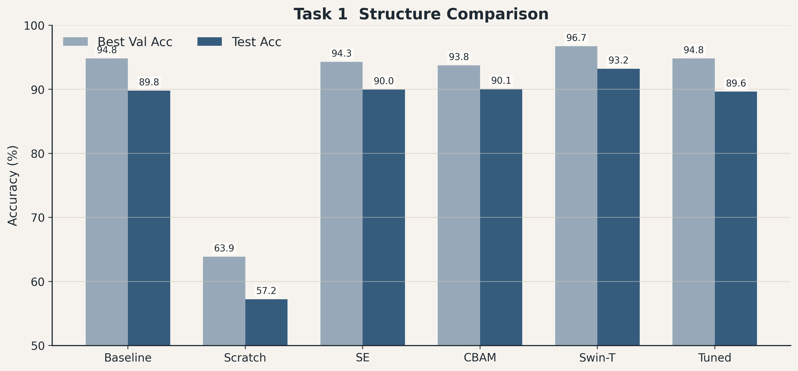
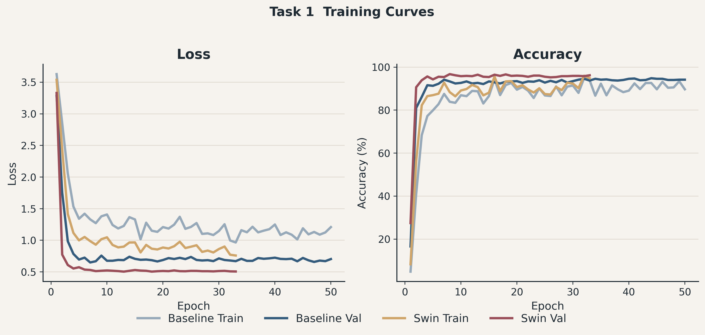
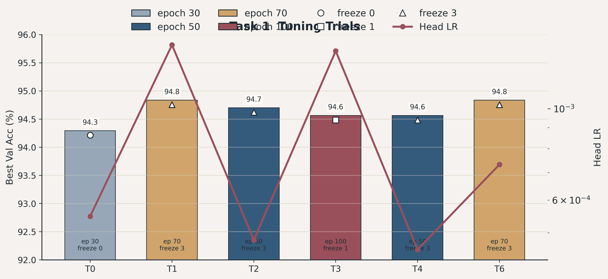
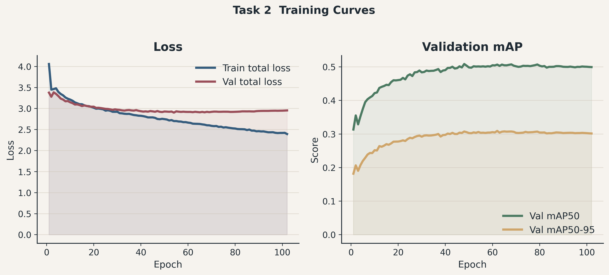
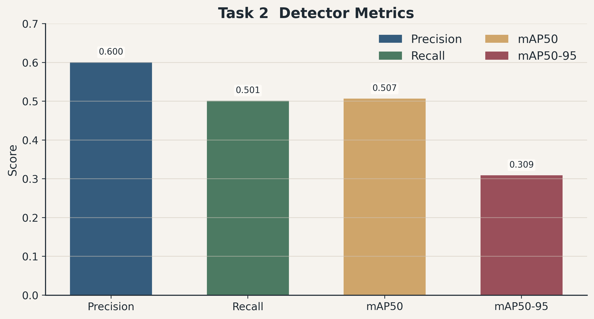
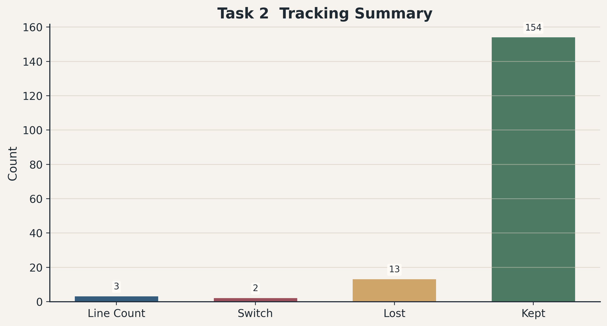
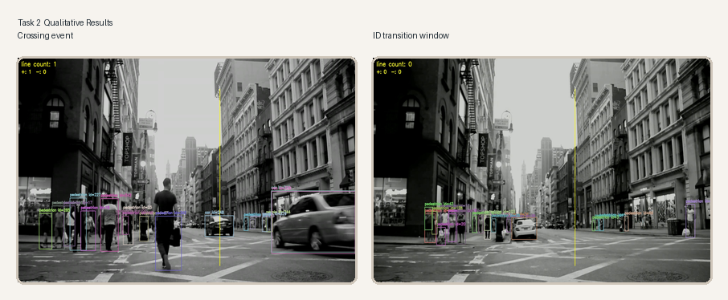
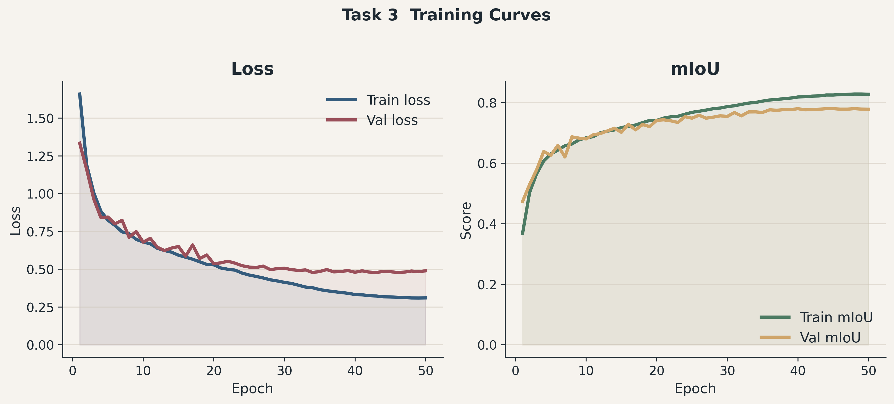
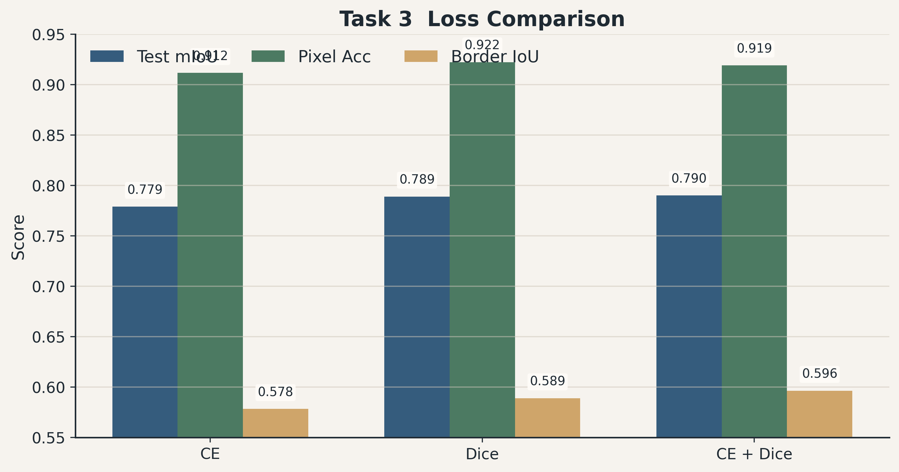
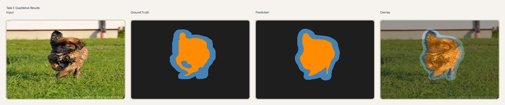

# 计算机视觉期中作业报告

- 姓名：xxx
- 学号：xxxxxxxx
- 分工：本项目无具体分工，由一人独立完成

## Task 1 微调在ImageNet上预训练的卷积神经网络实现宠物识别

### 基本介绍

- Task 1 以 Oxford-IIIT Pet 37 类宠物品种分类为目标，预训练卷积网络微调，并围绕题目要求补充预训练消融、注意力机制和 Transformer 结构对比
- 数据源来自本地 parquet 版本 Oxford-IIIT Pet，训练与验证样本从 `trainval` 划分，测试集使用官方 `test` split
- 最终最优模型是 `Swin-Tiny`，测试集准确率达到 `93.21%`，显著高于卷积基线

| 实验标签                     | 结构           | 预训练 | 测试集准确率 |
| ---------------------------- | -------------- | -----: | -----------: |
| baseline_pretrained_resnet34 | ResNet34       |     是 |       89.81% |
| scratch_resnet34_fair        | ResNet34       |     否 |       57.21% |
| se_resnet34                  | SE-ResNet34    |     是 |       90.00% |
| cbam_resnet34                | CBAM-ResNet34  |     是 |       90.05% |
| swin_tiny                    | Swin-Tiny      |     是 |       93.21% |
| tuned_best                   | ResNet34 tuned |     是 |       89.64% |

  

从结构对比可以直接看到两点：

- 第一，预训练收益极大，从零训练的 ResNet34 与预训练基线相差 `32.60` 个百分点，这说明该任务并不适合在当前数据规模上完全从头学习高质量表征
- 第二，SE 与 CBAM 仅带来约 `0.2` 个百分点级别的测试提升，而 Swin-Tiny 带来了超过 `3` 个百分点的提升，说明细粒度品种区分更依赖全局上下文和长距离依赖建模，而不仅依赖卷积局部感受野上的轻量注意力修正

### 详细实验设置

主配置文件为 [task1_baseline.yaml](/cpfs01/projects-HDD/cfff-d9e1999a777f_HDD/tyg_23300200022/CV/HW2/configs/task1_baseline.yaml:1)

| 项目            | 设置                                                          |
| --------------- | ------------------------------------------------------------- |
| 数据集          | Oxford-IIIT Pet 分类                                          |
| 数据来源        | 本地 parquet                                                  |
| 类别数          | 37                                                            |
| 训练集划分      | `trainval` 按类别分层随机划分                               |
| 训练集大小      | 2944                                                          |
| 验证集大小      | 736                                                           |
| 测试集大小      | 3669                                                          |
| 主基线模型      | `ResNet34 pretrained`                                       |
| 输入尺寸        | `256 x 256`                                                 |
| batch size      | 64                                                            |
| 每 epoch 迭代数 | 46                                                            |
| 优化器          | AdamW                                                         |
| 分类头学习率    | `5e-4`                                                      |
| 主干学习率      | `5e-5`                                                      |
| 权重衰减        | `1e-4`                                                      |
| 训练 epoch      | 50                                                            |
| 冻结策略        | `freeze_backbone_epochs = 0`                                |
| 损失函数        | Cross Entropy(label_smoothing = 0.05)                      |
| 调度器          | Warmup 3 epoch + Cosine                                       |
| 混合增强        | Mixup `0.2`，CutMix `1.0`                                 |
| 图像增强        | RandomResizedCrop、HorizontalFlip、ColorJitter、RandomErasing |
| 测试策略        | Horizontal Flip TTA                                           |
| 评价指标        | `val_acc`，`test_acc`                                     |

### 训练结果与可视化

| 实验标签                     | best epoch | best val acc | test acc | test loss |
| ---------------------------- | ---------: | -----------: | -------: | --------: |
| baseline_pretrained_resnet34 |         44 |       94.84% |   89.81% |    0.7948 |
| scratch_resnet34_fair        |         83 |       63.86% |   57.21% |    1.6133 |
| se_resnet34                  |         34 |       94.29% |   90.00% |    0.8146 |
| cbam_resnet34                |         49 |       93.75% |   90.05% |    0.7861 |
| swin_tiny                    |          8 |       96.74% |   93.21% |    0.5766 |
| tuned_best                   |         60 |       94.84% |   89.64% |    0.8404 |

  

训练曲线和最终指标说明了两点

- baseline 与最终最佳的 Swin-Tiny 都能稳定收敛，但 Swin-Tiny 在更早阶段就达到更高验证准确率，并保持更低验证损失，这与其更强的表征能力一致
- 几乎所有分类实验都存在验证集准确率高于测试集准确率的情况，其中 baseline 从 `94.84%` 下降到 `89.81%`，Swin-Tiny 从 `96.74%` 下降到 `93.21%`，同一验证集被多轮结构选择和调参反复使用，导致验证指标产生了乐观偏差，这可以视为模型选择阶段对验证集的适配
- 题目要求分析训练步数、学习率及其组合影响，因此在 baseline 微调主线上使用 Optuna 只调整四个参数，分别是 `head_lr`、`backbone_lr_ratio`、`freeze_backbone_epochs` 和 `epochs`
- Optuna 基本原理：
  - 把每一组超参数视为一个 trial，每个 trial 都会实际启动一轮训练，并以该轮训练得到的 `best_val_acc` 作为目标值；采样器使用 TPE 根据历史 trial 的好坏分布决定下一轮更值得尝试的参数区域，剪枝器则会在中途提前停止明显落后的 trial，从而减少无效训练开销

| 参数                   | 搜索空间                         |
| ---------------------- | -------------------------------- |
| head_lr                | `3e-4` 到 `1.5e-3`，对数采样 |
| backbone_lr_ratio      | `0.05` `0.1` `0.2`         |
| freeze_backbone_epochs | `0` `1` `3`                |
| epochs                 | `30` `50` `70` `100`     |

| 最优 trial 参数        |      数值 |
| ---------------------- | --------: |
| head_lr                | 0.0014291 |
| backbone_lr_ratio      |      0.05 |
| freeze_backbone_epochs |         3 |
| epochs                 |        70 |
| best val acc           |    94.84% |
| tuned test acc         |    89.64% |

  

调参结果还说明：

- 更长训练和更高头部学习率可以把验证集推到和 baseline 相同的峰值，但没有提高测试集准确率，反而略有下降，这说明在当前数据与增强组合下，baseline 的瓶颈已经不主要来自训练步数或学习率，而更多来自结构表达能力本身
- 此外，AdamW相比于SGD更容易产生分布偏置，导致泛化能力下降，覆盖超参收益，可能也是原因之一

---

## Task 2 场景目标检测与视频多目标跟踪

### 基本介绍

- Task 2 由两个阶段组成，第一阶段在 VisDrone2019-DET 上训练检测器，第二阶段把最佳权重用于本地 `demo.mp4` 视频跟踪，再完成遮挡与 ID 跳变分析以及越线计数
- 检测器采用 `YOLOv8m`，跟踪器采用 `BoT-SORT`，最终检测模型在验证集上达到 `mAP50 = 0.5069`、`mAP50-95 = 0.3092`，视频跟踪阶段在新视频上统计到 `3` 次越线事件，同时在自动选中的分析窗口中检测到 `2` 次 ID switch 和 `13` 次 lost 事件
- *BoT-SORT 核心思路：先利用检测器得到每帧候选框，再结合卡尔曼滤波的运动预测、IoU 匹配以及 ReID 外观特征完成跨帧关联，因此它在目标间距较大时能稳定维持 ID，但在密集遮挡、外观相似和短时失检场景中仍然可能出现轨迹中断或 ID 重新分配

| 模块     | 最终结果                                  |
| -------- | ----------------------------------------- |
| 检测模型 | `YOLOv8m`                               |
| 跟踪器   | `BoT-SORT`                              |
| 检测指标 | `mAP50 = 0.5069`，`mAP50-95 = 0.3092` |
| 跟踪结果 | `line_count = 3`                        |
| 遮挡分析 | `switch_count = 2`，`lost_count = 13` |

### 详细实验设置

主配置文件为 [task2_visdrone.yaml](/cpfs01/projects-HDD/cfff-d9e1999a777f_HDD/tyg_23300200022/CV/HW2/configs/task2_visdrone.yaml:1)

| 项目            | 设置                                                          |
| --------------- | ------------------------------------------------------------- |
| 检测数据集      | VisDrone2019-DET                                              |
| 类别数          | 10                                                            |
| 数据划分        | `images/train` `images/val` `images/test`               |
| 训练集大小      | 6471                                                          |
| 验证集大小      | 548                                                           |
| 测试集大小      | 1610                                                          |
| 检测模型        | `yolov8m.pt`                                                |
| 输入尺寸        | 896                                                           |
| batch size      | 32                                                            |
| 每 epoch 迭代数 | 203                                                           |
| 训练 epoch      | 120                                                           |
| 优化器          | SGD                                                           |
| 调度器          | Cosine LR                                                     |
| 数据增强        | HSV、translate、scale、fliplr、mosaic                         |
| 跟踪器          | `botsort.yaml`                                              |
| 跟踪视频        | `data/videos/demo.mp4`                                      |
| 检测阈值        | `conf = 0.25`                                               |
| IoU 阈值        | `iou = 0.5`                                                 |
| 计数线          | 竖线 `[(1150,150),(1150,1000)]`                             |
| 评价指标        | Precision、Recall、mAP50、mAP50-95、ID transition、line count |

### 训练结果与可视化

| 检测指标  |   数值 |
| --------- | -----: |
| Precision | 0.6002 |
| Recall    | 0.5014 |
| mAP50     | 0.5069 |
| mAP50-95  | 0.3092 |

  

  

- 训练曲线显示检测器在前期快速下降，随后验证 `mAP50` 和 `mAP50-95` 逐步收敛，说明当前 `120` 个 epoch 足以完成稳定训练

| 跟踪统计       | 数值 |
| -------------- | ---: |
| 处理帧数       |  349 |
| line count     |    3 |
| positive count |    3 |
| negative count |    0 |
| switch count   |    2 |
| lost count     |   13 |
| kept count     |  154 |

  

  

注意：

- 测试视频来自网络公开视频
- 本项目没有继续使用固定抽帧，而是先完成整段视频跟踪，再自动抽取 ID switch 或 lost 事件附近的窗口作为分析帧，如果当前视频中不存在此类事件，才退回到越线事件附近帧，因此导出的关键帧都和真实跟踪异常直接对应
- 自动选中的分析窗口覆盖 `58` 到 `62` 帧和 `76` 到 `80` 帧，两段窗口内分别出现连续拥挤行人和局部遮挡，统计结果显示 `switch_count = 2` 但 `lost_count = 13`，说明当前场景中的主要问题不是大规模错误换ID，而是目标因遮挡、离开画面、尺度过小或检测不稳定等而暂时失去连续关联
- 以 `frame 59 -> 60` 和 `frame 77 -> 78` 为代表的两次 ID switch 表明，BoT-SORT 虽然结合了运动和外观信息进行关联，但在行人密集、外观相似、短时遮挡明显的场景下，仍然会把原有轨迹重新分配给新的检测框
- 越线计数方面，本项目将计数线改为画面中间偏右的竖线以适应该视频车辆运动方向，结果从无效的 `0` 次计数变成最终 `3` 次清晰事件，上图中展示了越线事件与 ID 变化窗口，三张事件帧都显示车辆中心点在竖线附近通过

---

## Task 3 从零搭建与损失函数工程 图像分割模型的像素级训练

### 基本介绍

Task 3 要求在 Oxford-IIIT Pet 三类分割任务上比较 `CE`、`Dice` 和 `CE + Dice` 三种损失函数，模型完全使用自定义 U-Net 实现，不依赖预训练编码器
最终最佳实验为 `CE + Dice`，测试集 `mIoU = 0.7901`，略高于 `Dice only` 的 `0.7890`，明显高于 `CE only` 的 `0.7789`

- 模型结构：
  - 模型采用标准 `U-Net` 编解码结构，编码端由 `DoubleConv` 和四个 `DownBlock` 组成，通道数依次扩展为 `64, 128, 256, 512, 1024`
  - bottleneck 位置加入 `Dropout2d`，用于缓解中间高维特征的过拟合
  - 解码端由四个 `UpBlock` 组成，每一级先上采样，再与对应编码层特征进行 skip connection 拼接，最后经过 `DoubleConv` 融合
  - 输出层使用 `1x1` 卷积将通道映射到三类掩码，对应 `pet`、`background` 和 `border`
  - 从网络拓扑上看，U-Net 的关键优势在于对称的编码器与解码器结构以及跨层 skip connection，前者负责逐步扩大感受野、提取高层语义，后者负责逐步恢复空间分辨率，而 skip connection 能把浅层边缘和纹理信息直接传递到解码端，因此特别适合当前这种同时要求区域一致性和边界精度的分割任务
- 三种损失的基本形式：
  - `CE` 采用逐像素交叉熵，其形式为
    $$
    L_{\mathrm{CE}} = - \frac{1}{N} \sum_{i=1}^{N} \sum_{c=1}^{C} y_{i,c} \log p_{i,c}
    $$
  - `Dice` 直接优化预测区域与真实区域的重叠程度，其形式为
    $$
    L_{\mathrm{Dice}} = 1 - \frac{2 \sum_{i=1}^{N} p_i g_i + \varepsilon}{\sum_{i=1}^{N} p_i + \sum_{i=1}^{N} g_i + \varepsilon}
    $$
  - `CE + Dice` 将两者线性组合，本项目中两个权重都设为 `1.0`，其形式为
    $$
    L = \lambda_{\mathrm{CE}} L_{\mathrm{CE}} + \lambda_{\mathrm{Dice}} L_{\mathrm{Dice}}
    $$

| 实验标签  | 损失函数  | test mIoU | test pixel acc |
| --------- | --------- | --------: | -------------: |
| ce_only   | CE        |    0.7789 |         0.9117 |
| dice_only | Dice      |    0.7890 |         0.9223 |
| ce_dice   | CE + Dice |    0.7901 |         0.9191 |

从整体指标上看可以得到三点结论

- 三种损失之间的差距不算巨大，但排序稳定
- 纯 CE 最弱，说明在前景边界和类别不均衡同时存在的分割任务中，仅靠逐像素分类损失不够
- `CE + Dice` 在保持整体分类稳定性的同时，又补充了区域级约束，因此最终在 mIoU 上取得最好结果

### 详细实验设置

主配置文件为 [task3_unet.yaml](/cpfs01/projects-HDD/cfff-d9e1999a777f_HDD/tyg_23300200022/CV/HW2/configs/task3_unet.yaml:1)

| 项目               | 设置                                          |
| ------------------ | --------------------------------------------- |
| 数据集             | Oxford-IIIT Pet Segmentation                  |
| 数据来源           | 本地 parquet                                  |
| 类别定义           | `pet` `background` `border`             |
| 训练集划分         | `trainval` 按分类标签分层随机划分           |
| 训练集大小         | 2944                                          |
| 验证集大小         | 736                                           |
| 测试集大小         | 3669                                          |
| 模型               | 手写 U-Net                                    |
| 输入尺寸           | `256 x 256`                                 |
| 编码起始通道数     | 64                                            |
| bottleneck dropout | 0.2                                           |
| 上采样方式         | 转置卷积                                      |
| 初始化方式         | Kaiming                                       |
| batch size         | 12                                            |
| 每 epoch 迭代数    | 246                                           |
| 优化器             | AdamW                                         |
| 学习率             | `1e-3`                                      |
| 权重衰减           | `1e-4`                                      |
| 调度器             | Warmup 2 epoch + Cosine                       |
| 训练 epoch         | 50                                            |
| 图像增强           | HorizontalFlip、ShiftScaleRotate、ColorJitter |
| 损失函数           | `CE` `Dice` `CE + Dice`                 |
| 类别权重           | 自动统计生成                                  |
| 评价指标           | mIoU、classwise IoU、pixel accuracy           |

- 本项目对三类分割使用了自动统计类别权重，`border` 的权重最高，这与该类像素占比较低相一致
- 即便如此，`border` 仍然是最难的类别，这意味着难点不仅来自类别不均衡，还来自边界窄、标注精细、空间误差容忍度低

### 训练结果与可视化

| 实验          | best epoch | best val mIoU | test mIoU | test pixel acc | test loss |
| ------------- | ---------: | ------------: | --------: | -------------: | --------: |
| `ce_only`   |         45 |        0.7675 |    0.7789 |         0.9117 |    0.3236 |
| `dice_only` |         48 |        0.7847 |    0.7890 |         0.9223 |    0.1262 |
| `ce_dice`   |         45 |        0.7797 |    0.7901 |         0.9191 |    0.5002 |

| 实验          | pet IoU | background IoU | border IoU |
| ------------- | ------: | -------------: | ---------: |
| `ce_only`   |  0.8473 |         0.9112 |     0.5783 |
| `dice_only` |  0.8560 |         0.9221 |     0.5889 |
| `ce_dice`   |  0.8545 |         0.9195 |     0.5964 |

  

  

  

分割结果还体现出两点

- `CE + Dice` 的训练曲线整体平稳，验证 mIoU 在中后期进入平台区，说明当前 `50` 个 epoch 已经足以接近收敛，其优势主要体现在 `border` 类别上，`border IoU` 达到 `0.5964`，高于 `Dice only` 的 `0.5889` 和 `CE only` 的 `0.5783`，这说明混合损失更擅长在整体区域一致性和边缘细节之间取得平衡
- `Dice only` 的 pixel accuracy 最高，但 mIoU 略低于 `CE + Dice`，说明单看像素准确率会偏向面积较大的类别，而 mIoU 对小区域和边缘区域更敏感，因此作为该任务的主指标更合理

---

## 结论

- Task 1 表明预训练是最关键的性能来源，卷积基线从零训练时无法建立足够稳定的细粒度表征，而引入全局建模能力更强的 Swin-Tiny 后，测试集准确率提升到 `93.21%`，显著超过基线与注意力卷积结构
- Task 1 的调参结果进一步说明，训练步数、学习率和冻结策略能够影响验证集峰值，但在当前实验设置下并未转化为更高测试性能，此时结构升级的收益大于纯超参数微调
- Task 2 表明当前 `YOLOv8m + BoT-SORT` 组合已经可以支撑完整的视频级输出链路，包括检测、跟踪、遮挡分析和越线计数
- 该任务的主要误差来源不是大量 ID 错绑，而是小目标、短时遮挡和失检带来的轨迹丢失，因此后续若继续提升，优先考虑检测器的小目标召回与跟踪阶段的遮挡恢复能力
- Task 3 表明手写 U-Net 在 Oxford-IIIT Pet 三类分割任务上能够稳定收敛，三种损失函数中 `CE + Dice` 获得了最高的测试 mIoU，并且在最困难的 `border` 类别上也取得最好结果
- 说明对于同时包含类别不均衡与细边界结构的分割任务，逐像素分类约束与区域重叠约束的组合比单独使用其中任意一种更稳健

---

## 附录

### 数据来源

| 任务   | 数据来源                                              |
| ------ | ----------------------------------------------------- |
| Task 1 | `data/oxford-iiit-pet` 本地 parquet                 |
| Task 2 | `data/VisDrone2019-DET` 与 `data/videos/demo.mp4` |
| Task 3 | `data/oxford_iiit_pet_hf_seg` 本地 parquet          |

### 统一训练与导出机制

| 项目                      | 说明                                                                                                                                   |
| ------------------------- | -------------------------------------------------------------------------------------------------------------------------------------- |
| Task 1 与 Task 3 训练框架 | 自定义 PyTorch 训练循环，支持 AMP、验证集最佳 checkpoint、`history.json` 导出等                                                      |
| Task 2 检测训练           | Ultralytics 原生 YOLO 训练流程                                                                                                         |
| 曲线可视化来源            | 本项目未使用 wandb 或 swanlab，报告曲线由 `history.json`、`summary.json`、`results.csv` 和检测结果二次绘制                       |
| 视频导出                  | 跟踪视频先写入临时视频，再转为标准 H.264 MP4，以保证播放器兼容性                                                                       |
| 报告图表                  | 由[generate_report_assets.py](/cpfs01/projects-HDD/cfff-d9e1999a777f_HDD/tyg_23300200022/CV/HW2/scripts/generate_report_assets.py:1) 生成 |

### *未使用 wandb 或 swanlab 的原因

本项目没有接入 wandb 或 swanlab，主要出于自定义可视化和统一资产管理两方面考虑

- 当前训练与评估流水线可稳定导出完整的本地日志文件，包括 Task 1 与 Task 3 的 `history.json`，以及 Task 2 检测阶段的 `results.csv` 与原生结果图，已覆盖要求中的训练曲线、验证曲线和最终指标
- 本报告不仅需要常规折线图，还需要把 Task 2 的越线事件帧、ID 变化窗口，以及 Task 3 的输入图、标注图、预测图和叠加图统一纳入同一视觉风格下管理，本地脚本生成方式在版式、颜色、标题、拼图和分辨率上有更高自由度
- 从工程复现角度看，采用本地 JSON 与 CSV 直接生成图表还能避免账号、网络、服务状态和项目权限配置对复现实验的影响，使仓库在服务器和离线环境下都能独立完成训练与报告生成
